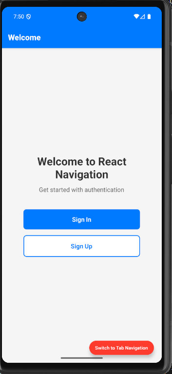
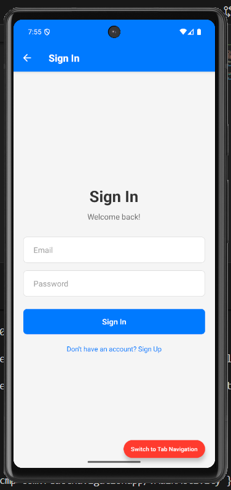
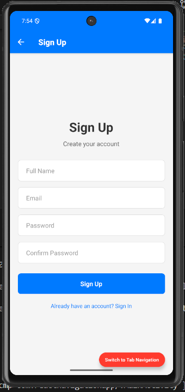
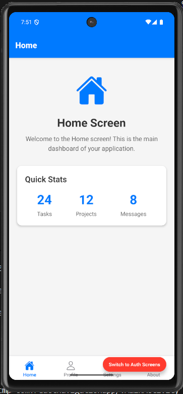
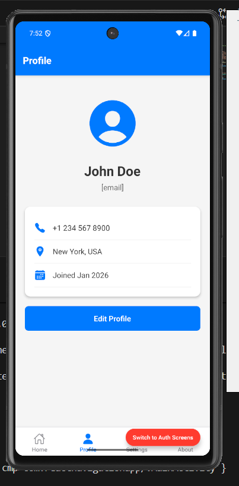
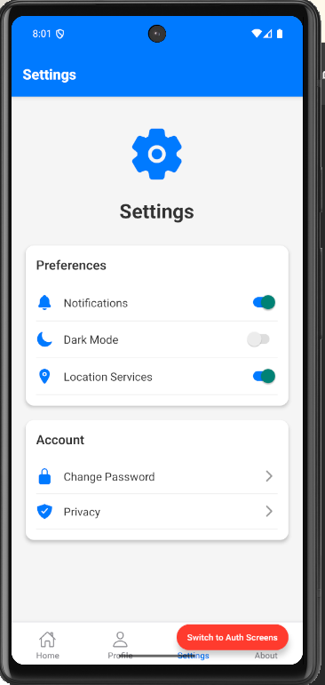
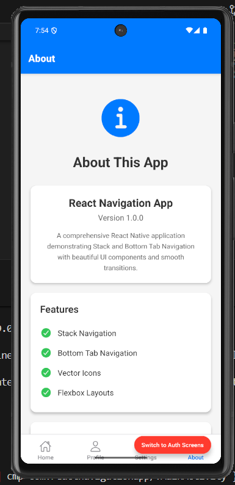
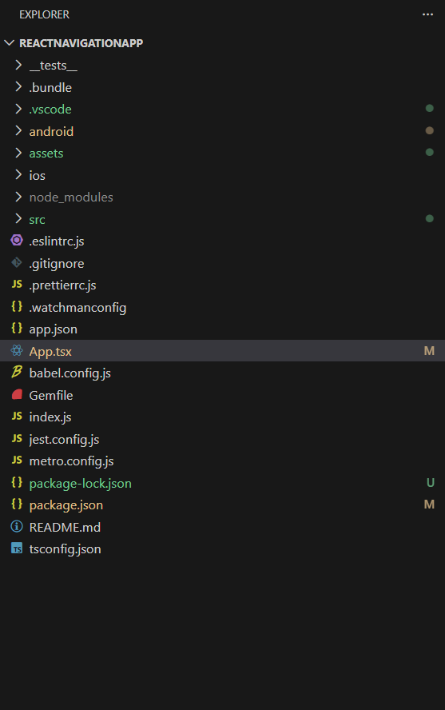

# React Native Navigation App - Assignment 3

This React Native application demonstrates navigation patterns including Stack Navigation and Bottom Tab Navigation, built as part of Assignment 3.

## Assignment Overview

**Total Marks:** 40  
**Due Date:** January 22, 2026

### Task 1: Stack Navigation (20 marks)
- Built a 3-screen authentication flow with Stack Navigation
- Screens: Welcome, Sign In, Sign Up
- Implemented Flexbox styling and component-driven development

### Task 2: Bottom Tab Navigation (20 marks)
- Created a bottom tab navigator with 4 screens
- Screens: Home, Profile, Settings, About
- Includes custom icons with active/inactive styling

## Screenshots

### Task 1: Stack Navigation Screens

**Welcome Screen**  


**Sign In Screen**  


**Sign Up Screen**  


### Task 2: Bottom Tab Navigation Screens

**Home Screen**  


**Profile Screen**  


**Settings Screen**  


**About Screen**  


### Project Structure



## Installation & Setup

1. Clone the repository:
```bash
git clone https://github.com/wa4lo7k/react-nativea-app.git
cd react-nativea-app
```

2. Install dependencies:
```bash
npm install
```

3. For iOS, install CocoaPods dependencies:
```bash
cd ios
pod install
cd ..
```

## Running the App

### Android
```bash
npm run android
```

### iOS
```bash
npm run ios
```

## Technologies Used

- React Native
- React Navigation (Stack & Bottom Tabs)
- TypeScript
- Flexbox for responsive layouts
- Component-based architecture

## Project Structure

```
src/
├── components/     # Reusable UI components
├── navigation/     # Navigation configuration
└── screens/        # Screen components
    ├── Welcome.tsx
    ├── SignIn.tsx
    ├── SignUp.tsx
    ├── Home.tsx
    ├── Profile.tsx
    ├── Settings.tsx
    └── About.tsx
```

## Submission Details

- Project folder (without node_modules)
- Screenshots included in `/assets` folder
- Repository: https://github.com/wa4lo7k/react-nativea-app.git
